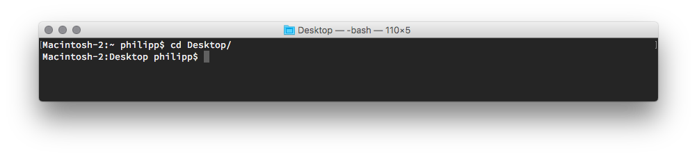
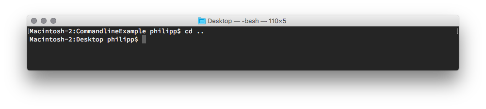
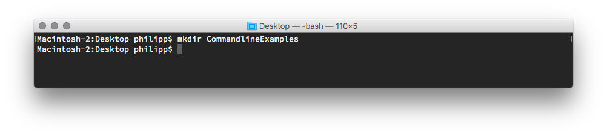
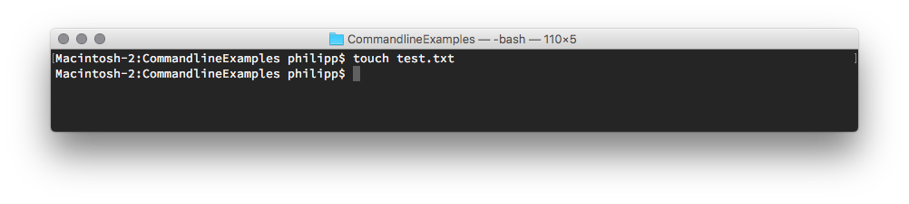
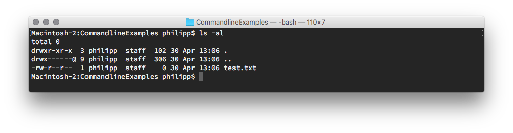
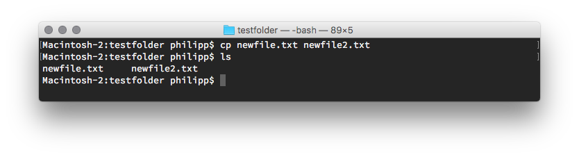
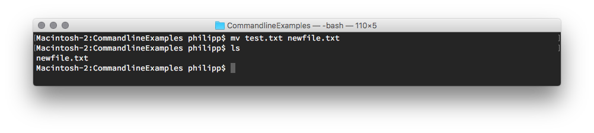
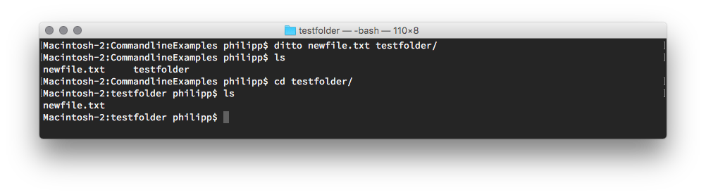
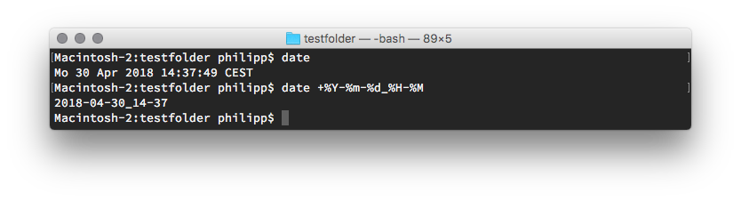
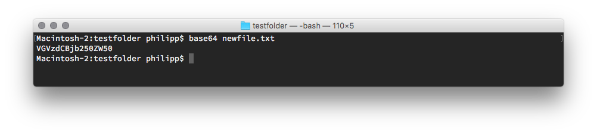

# Command Line

## Working with files and folders

| Command | Description |
| --- | --- |
|`cd`| Changes directory. You can drag the destination into the terminal windows instead of typing the path. |
|`cd ..`| Move one directory up. |
|`mkdir`| Creates a directory. |
|`touch`| Creates a file. |
|`ls -al`| Displays all files of current directory in a list view. |
|`open .`| Opens the Finder windows on the current location.|
|`open`| Opens a file in it’s standard application. |
|`cp`| Copy file to destination; can also be used to duplicate file |
|`mv`| Moves file; can also be used to rename file. |
|`ditto`| Copy folder to another destination. |
|`date`| Get the current date. You can add [formatting options](https://docs.python.org/3/library/datetime.html#strftime-and-strptime-behavior) as arguments. E.g. `+%Y-%m-%d_%H-%M` |

## Navigating the terminal

| Command | Description |
| --- | --- |
|`pwd`| Shows current path.|
|`ctrl`+`c`| Cancels current process.|
|`cmd`+ `k`| Clears terminal.|
|`history`| Shows last used commands.|
|`↑`| (Arrow up) Use last command; cycles through history.|
|`⇥`| (tab key) Completes filenames.|
|`alt`+ (click)| Move cursor to specific position in command.|

## Handy commands

| Command | Description |
| --- | --- |
|(some command) + `-h`| See the usage help of the command.|
|`base64`| Shows file as base64 string. Useful, when you want to embed a font in your css file. |
|`sudo`| Authenticate yourself as superuser to gain extra priviliges to do stuff.|
|`defaults write com.apple.finder AppleShowAllFiles TRUE`| Shows hidden files in Finder. To make it work, you have to restart finder with `killall Finder`|
|`defaults write NSGlobalDomain AppleShowAllExtensions -bool true`| Shows file extensions in Finder. To make it work, you have to restart finder with `killall Finder`|
|`caffeinate`| Prevent your Mac from going to sleep. Use `cmd`+ `c` to go back to it’s normal sleeping schedule|
