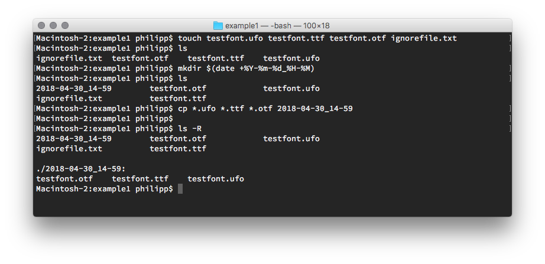

# Example #1

This example workflow shows how to create a backup folder of all file with the extensions .ufo, .ttf and .otf.

## Basic commands

* `touch` to create dummy testfiles
* `$()` to nest the output of a command.
* `date +%Y-%m-%d_%H-%M` to get the current time.
* `mkdir` to create a new folder
* `cp` to copy files

## Terminal example


## Shell script
You can automate and reuse command by writing them into a shell script. You can run in via `sh backup_fontfiles.sh`.

### backup_fontfiles.sh

```sh
#!/bin/sh
# The first line is needed, so the terminal understands what to do with this file

# Set the variable for the folder where the fonts are in.
fontfolder=testfiles

# Uncomment next line if the fonts are in the same folder
#fontfolder=.


# Get the current timestamp and store it in a variable
now=$(date +%Y-%m-%d_%H-%M)

# Create a folder with the current timestamp as name
mkdir $now

# Copy files to new folder
cp $fontfolder/*.ufo $fontfolder/*.ttf $fontfolder/*.otf $now

# Print feedback to terminal
echo "Backupped files to folder: $now:"

# Show contents of new folder in terminal
ls $now
```


